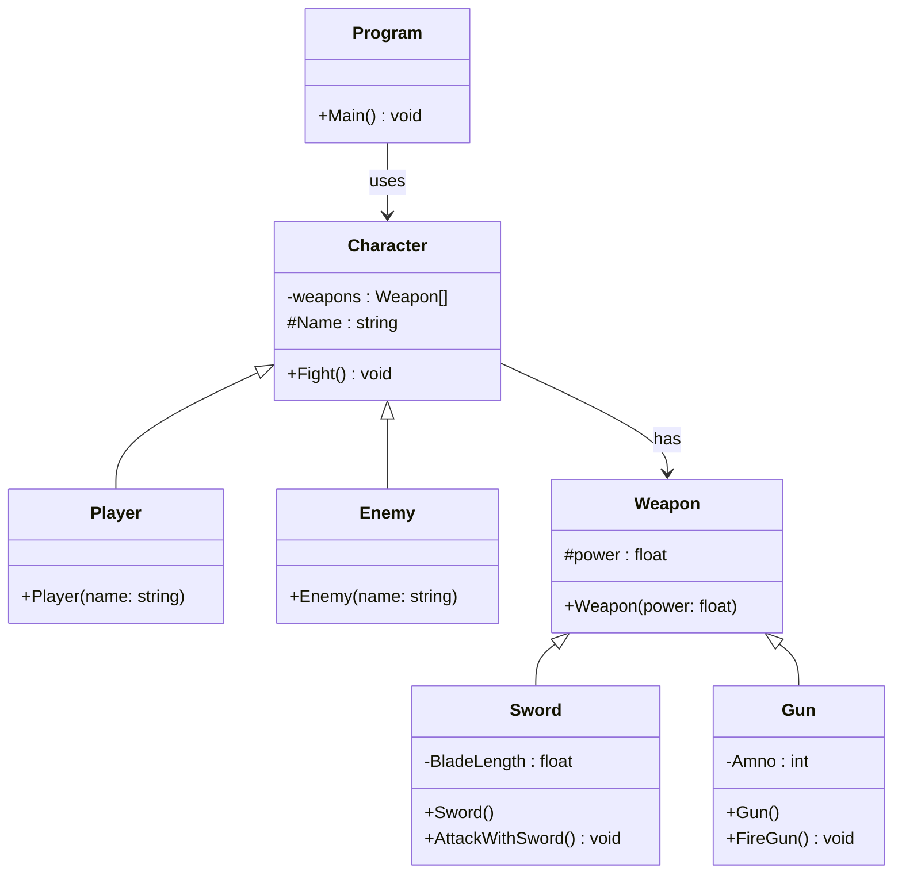

```mermaid
classDiagram
    class Program {
        +Main() void
    }

    class Character {
        -weapons : Weapon[]
        #Name : string
        +Fight() void
    }

    class Player {
        +Player(name: string)
    }

    class Enemy {
        +Enemy(name: string)
    }

    class Weapon {
        #power : float
        +Weapon(power: float)
    }

    class Sword {
        -BladeLength : float
        +Sword()
        +AttackWithSword() void
    }

    class Gun {
        -Amno : int
        +Gun()
        +FireGun() void
    }

    Program --> Character : uses
    Character <|-- Player
    Character <|-- Enemy
    Character --> Weapon : has
    Weapon <|-- Sword
    Weapon <|-- Gun
```